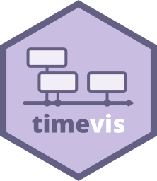

<p align="center">

<h3 align="center">timevis</h3>

<h4 align="center">Create interactive timeline visualizations in R
<br><br>
<a href="https://daattali.com/shiny/timevis-demo/">Demo</a>
&middot;
by <a href="https://deanattali.com">Dean Attali</a>
</h4>

<p align="center">
<a href="https://github.com/daattali/timevis/actions">

</a>
<a href="https://cran.r-project.org/package=timevis">

</a>
</p>

</p>

---



{timevis} lets you create rich and *fully interactive* timeline
visualizations in R. Timelines can be included in Shiny apps and R
markdown documents, or viewed from the R console and RStudio Viewer.
{timevis} includes an extensive API to manipulate a timeline after
creation, and supports getting data out of the visualization into R.
This package is based on the [visjs](https://visjs.org/) Timeline
JavaScript library.

**Need Shiny help? [I’m available for
consulting](https://attalitech.com/).**<br/> **If you find {timevis}
useful, please consider [supporting my
work](https://github.com/sponsors/daattali) to unlock rewards\! ❤**

<p align="center">

<a style="display: inline-block;" href="https://github.com/sponsors/daattali">
 </a>

</p>

> This package is part of a larger ecosystem of packages with a shared
> vision: solving common Shiny issues and improving Shiny apps with
> minimal effort, minimal code changes, and straightforward
> documentation. Other packages for your Shiny apps:

<table>
<colgroup>
<col style="width: 33%" />
<col style="width: 33%" />
<col style="width: 33%" />
</colgroup>
<thead>
<tr class="header">
<th>Package</th>
<th>Description</th>
<th>Demo</th>
</tr>
</thead>
<tbody>
<tr class="odd">
<td><a href="https://deanattali.com/shinyjs/">shinyjs</a></td>
<td>💡 Easily improve the user experience of your Shiny apps in seconds</td>
<td><a href="https://deanattali.com/shinyjs/overview#demo">🔗</a></td>
</tr>
<tr class="even">
<td><a href="https://github.com/daattali/shinyalert">shinyalert</a></td>
<td>🗯️ Easily create pretty popup messages (modals) in Shiny</td>
<td><a href="https://daattali.com/shiny/shinyalert-demo/">🔗</a></td>
</tr>
<tr class="odd">
<td><a href="https://github.com/daattali/shinyscreenshot/">shinyscreenshot</a></td>
<td>📷 Capture screenshots of entire pages or parts of pages in Shiny apps</td>
<td><a href="https://daattali.com/shiny/shinyscreenshot-demo/">🔗</a></td>
</tr>
<tr class="even">
<td><a href="https://github.com/daattali/shinycssloaders/">shinycssloaders</a></td>
<td>⌛ Add loading animations to a Shiny output while it’s recalculating</td>
<td><a href="https://daattali.com/shiny/shinycssloaders-demo/">🔗</a></td>
</tr>
<tr class="odd">
<td><a href="https://github.com/daattali/colourpicker/">colourpicker</a></td>
<td>🎨 A colour picker tool for Shiny and for selecting colours in plots</td>
<td><a href="https://daattali.com/shiny/colourInput/">🔗</a></td>
</tr>
<tr class="even">
<td><a href="https://github.com/daattali/shinybrowser/">shinybrowser</a></td>
<td>🌐 Find out information about a user’s web browser in Shiny apps</td>
<td><a href="https://daattali.com/shiny/shinybrowser-demo/">🔗</a></td>
</tr>
<tr class="odd">
<td><a href="https://github.com/daattali/shinydisconnect/">shinydisconnect</a></td>
<td>🔌 Show a nice message when a Shiny app disconnects or errors</td>
<td><a href="https://daattali.com/shiny/shinydisconnect-demo/">🔗</a></td>
</tr>
<tr class="even">
<td><a href="https://github.com/daattali/shinyforms/">shinyforms</a></td>
<td>📝 Easily create questionnaire-type forms with Shiny</td>
<td>WIP</td>
</tr>
</tbody>
</table>

## Demo

[Click here](https://daattali.com/shiny/timevis-demo/) to view an
interactive demo of many {timevis} features.

Or check out examples from real users: [Pet Records by Jenna
Allen](https://jennadallen.shinyapps.io/pet-records-app/), [Mohamad
Ghassany’s life timeline](https://www.mghassany.com/blog/my-timetable/),
[an English Premier League game
timeline](https://vidigalbr.shinyapps.io/timevis_premier_league/). If
you create a cool timeline with {timevis} and want to share it, I’d love
to [hear about it](https://deanattali.com/contact/)\!

<h2 id="sponsors">

Sponsors 🏆

</h2>

> There are no sponsors yet

[Become the first sponsor for
{timevis}\!](https://github.com/sponsors/daattali/sponsorships?tier_id=39856)

## Table of contents

  - [Installation](#install)
  - [How to use](#usage)
  - [Slightly more advanced examples](#advanced-examples)
  - [Interactivity](#interactivity)
  - [Groups](#groups)
  - [Functions to manipulate a timeline](#manipulate-api)
  - [In a Shiny app](#shiny-apps)
      - [Retrieving data from the widget](#retrieve-data)

<h2 id="install">

Installation

</h2>

{timevis} is available through both CRAN and GitHub:

To install the stable CRAN version:

``` r
install.packages("timevis")
```

To install the latest development version from GitHub:

``` r
install.packages("remotes")
remotes::install_github("daattali/timevis")
```

<h2 id="usage">

How to use

</h2>

You can view a minimal timeline without any data by simply running

``` r
library(timevis)
timevis()
```


You can add data to the timeline by supplying a data.frame

``` r
data <- data.frame(
  id      = 1:4,
  content = c("Item one"  , "Item two"  ,"Ranged item", "Item four"),
  start   = c("2016-01-10", "2016-01-11", "2016-01-20", "2016-02-14 15:00:00"),
  end     = c(NA          ,           NA, "2016-02-04", NA)
)

timevis(data)
```


Every item must have a `content` and a `start` variable. If the item is
a range rather than a single point in time, you can supply an `end` as
well. `id` is only required if you want to access or manipulate an item.
There are more variables that can be used in the data.frame – they are
all documented in the help file for `?timevis()` under the **Data
format** section.

<h2 id="advanced-examples">

Slightly more advanced examples

</h2>

The content of an item can even include HTML, which makes it easy to
show any kind of data in a timeline, such as the matches of the 2014
World Cup:


If you know some CSS, you can completely customize the look of the
timeline:


By default, a timeline will show the current date as a red vertical line
and will have zoom in/out buttons. You can supply many customization
options to `timevis()` in order to get it just right (see `?timevis()`
for details).

<h2 id="interactivity">

Interactivity

</h2>

The timeline lets the user interact with it seamlessly. You can click on
the zoom in/out buttons or drag the timeline left/right in order to move
to past/future dates.

If you set the `editable = TRUE` option, then the user will be able to
add new items by double clicking, modify items by dragging, and delete
items by selecting them.

<h2 id="groups">

Groups

</h2>

You can use the groups feature to group together multiple items into
different “buckets”. When using groups, all items with the same group
are placed on one line. A vertical axis is displayed showing the group
names. Grouping items can be useful for a wide range of applications,
for example when showing availability of multiple people, rooms, or
other resources next to each other. You can also think of groups as
“adding a Y axis”, if that helps.

Here is an example of a timeline that has three groups: “Library”,
“Gym”, and “Pool”:


In order to use groups, items in the data need to have group ids, and a
separate dataframe containing the group information needs to be
provided. More information about using groups and the groups dataframe
is available in the help file for `?timevis()` under the **Groups**
section.

<h2 id="manipulate-api">

Functions to manipulate a timeline

</h2>

There are many functions that allow programmatic manipulation of a
timeline. For example: `addItem()` programmatically adds a new item,
`centerItem()` moves the timeline so that a given item is centered,
`setWindow()` sets the start and end dates of the timeline,
`setOptions()` updates the configuration options, and many more
functions are available.

There are two ways to call these timeline manipulation functions:

### 1\. Timeline manipulation using `%>%` on `timevis()`

You can manipulate a timeline widget during its creation by chaining
functions to the `timevis()` call. For example:

    timevis() %>%
      addItem(list(id = "item1", content = "one", start = "2016-08-01")) %>%
      centerItem("item1")

This method of manipulating a timeline is especially useful when
creating timeline widgets in the R console or in R markdown documents
because it can be used directly when initializing the widget.

### 2\. Timeline manipulation using a timeline’s ID

In Shiny apps, you can manipulate a timeline widget at any point after
its creation by referring to its ID. For example:

<pre>
library(shiny)

ui <- fluidPage(
  timevisOutput("mytime"),
  actionButton("btn", "Add item and center")
)

server <- function(input, output, session) {
  output$mytime <- renderTimevis(timevis())
  observeEvent(input$btn, {<strong>
    addItem("mytime", list(id = "item1", content = "one", start = "2016-08-01"))
    centerItem("mytime", "item1")</strong>
  })
}

shinyApp(ui = ui, server = server)
</pre>

You can even chain these functions and use this manipulation code
instead of the bold code:

    addItem("mytime", list(id = "item1", content = "one", start = "2016-08-01")) %>%
      centerItem("item1")

*Technical note: If you’re trying to understand how both methods of
timeline manipulation work, it might seem very bizarre to you. The
reason they work is that every manipulation function accepts either a
`timevis` object or the ID of one. In order to make chaining work, the
return value from these functions depend on the input: if a `timevis`
object was given, then an updated `timevis` object is returned, and if
an ID was given, then the same ID is returned.*

<h2 id="shiny-apps">

In a Shiny app

</h2>

You can add a timeline to a Shiny app by adding `timevisOutput()` to the
UI and `renderTimevis(timevis())` to the server.

<h3 id="retrieve-data">

Retrieving data from the widget

</h3>

It is possible to retrieve data from a timeline in a Shiny app. When a
timeline widget is created in a Shiny app, there are four pieces of
information that are always accessible as Shiny inputs. These inputs
have special names based on the timeline’s id. Suppose that a timeline
is created with an `outputId` of **“mytime”**, then the following four
input variables will be available:

  - **input$mytime\_data** - will return a data.frame containing the
    data of the items in the timeline. The input is updated every time
    an item is modified, added, or removed.
  - **input$mytime\_ids** - will return the IDs (a vector) of all the
    items in the timeline. The input is updated every time an item is
    added or removed from the timeline.
  - **input$mytime\_selected** - will return the IDs (a vector) of the
    selected items in the timeline. The input is updated every time an
    item is selected or unselected by the user. Note that this will not
    get updated if an item is selected programmatically using the API
    functions.
  - **input$mytime\_window** - will return a 2-element vector containing
    the minimum and maximum dates currently visible in the timeline. The
    input is updated every time the viewable window of dates is updated
    (by zooming or moving the window).
  - **input$mytime\_visible** - will return a list of IDs of items
    currently visible in the timeline.

-----

You can view examples of many of the features supported by checking out
the [demo Shiny app](https://daattali.com/shiny/timevis-demo/). If you
want to see how those examples were created, the full code for the
examples is inside
[inst/example](https://github.com/daattali/timevis/tree/master/inst/example).

Lastly, if you want to learn how to develop an htmlwidget to have
similar features as this package, you can check out the
[`timevisBasic`](https://github.com/daattali/timevisBasic) package or
[my tutorial on htmlwidgets
tips](https://deanattali.com/blog/advanced-htmlwidgets-tips/).

## Credits

Logo design by [Alfredo Hernández](https://aldomann.com/).
