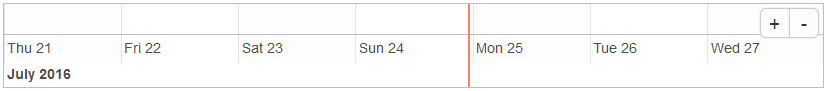
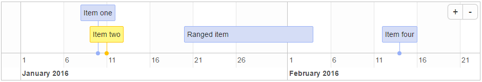
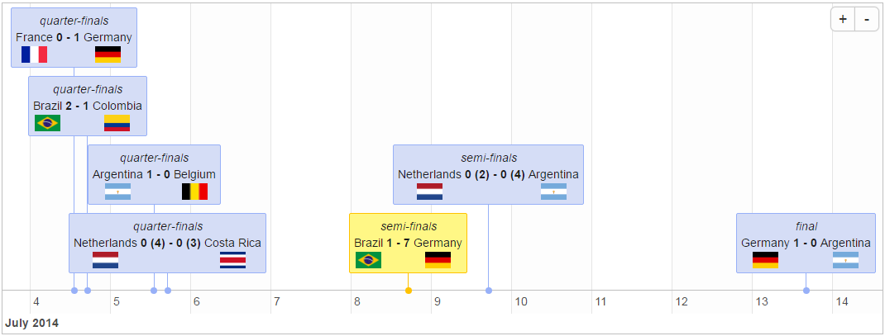
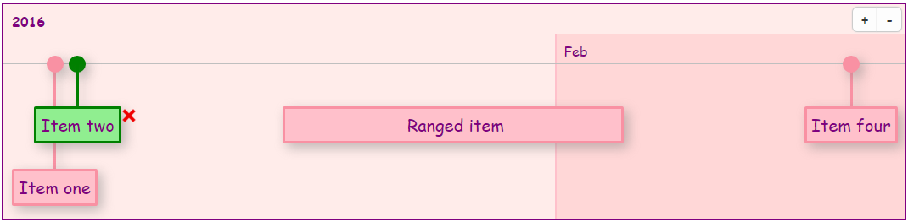

```{r setup, echo = FALSE, message = FALSE}
knitr::opts_chunk$set(tidy = FALSE, comment = "#>")
```

# timevis - Create interactive timeline visualizations in R

[](https://travis-ci.org/daattali/timevis)
[](https://cran.r-project.org/package=timevis)

`timevis` lets you create rich and *fully interactive* timeline visualizations in R. Timelines can be included in Shiny apps and R markdown documents, or viewed from the R console and RStudio Viewer. `timevis` includes an extensive API to manipulate a timeline after creation, and supports getting data out of the visualization into R. This package is based on the [vis.js](http://visjs.org/) Timeline module and the [htmlwidgets](http://www.htmlwidgets.org/) R package.

### Demo

[Click here](http://daattali.com/shiny/timevis-demo/) to view a live interactive demo of `timevis`.

### Installation

`timevis` is available through both CRAN and GitHub:

To install the stable CRAN version:

```{r eval=FALSE}
install.packages("timevis")
```

To install the latest development version from GitHub:

```{r eval=FALSE}
install.packages("devtools")
devtools::install_github("daattali/timevis")
```

### How to use

You can view a minimal timeline without any data by simply running

```{r eval=FALSE}
library(timevis)
timevis()
```



You can add data to the timeline by supplying a data.frame

```{r eval=FALSE}
data <- data.frame(
  id      = 1:4,
  content = c("Item one"  , "Item two"  ,"Ranged item", "Item four"),
  start   = c("2016-01-10", "2016-01-11", "2016-01-20", "2016-02-14 15:00:00"),
  end     = c(NA          ,           NA, "2016-02-04", NA)
)

timevis(data)
```



Every item must have a `content` and a `start` variable. If the item is a range rather than a single point in time, you can supply an `end` as well. `id` is only required if you want to access or manipulate an item. There are more variables that can be used in the data.frame -- they are all documented in the documentation for `?timevis()`.

The content of an item can even include HTML, which makes it easy to show any kind of data in a timeline, such as the matches of the 2014 World Cup:



If you know some CSS, you can completely customize the look of the timeline:



By default, a timeline will show the current date as a red vertical line and will have zoom in/out buttons. You can supply many customization options to `timevis()` in order to get it just right (see `?timevis()` for details).

### Interactivity

The timeline lets the user interact with it seamlessly. You can click on the zoom in/out buttons or drag the timeline left/right in order to move to past/future dates.

If you set the `editable = TRUE` option, then the user will be able to add new items by double clicking, modify items by dragging, and delete items by selecting them.

### In a Shiny app

You can add a timeline to a Shiny app by adding `timevisOutput()` to the UI and `renderTimevis(timevis())` to the server.

There are many functions that allow programmatic manipulation of a timeline. For example, `addItem()` programmatically adds a new item, `centerItem()` moves the timeline so that the given item is centered, `setWindow()` sets the start and end dates of the timeline, and more functions are available.

It is also possible to retrieve data from a timeline in a Shiny app. There are several types of data that are available, such as retriving the IDs of the currently selected items, or getting the data in the timeline (as a dataframe). These data will be available as input variables. For more information, read about the `getSelected`, `getWindow`, `getData`, and `getIds` parameters of `timevis()`.

You can view examples of many of the features supported by checking out the [demo Shiny app](http://daattali.com/shiny/timevis-demo/). If you want to see how those examples were created, the full code for the examples is inside [inst/example](https://github.com/daattali/timevis/tree/master/inst/example).
